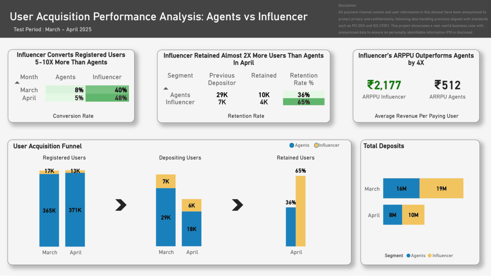
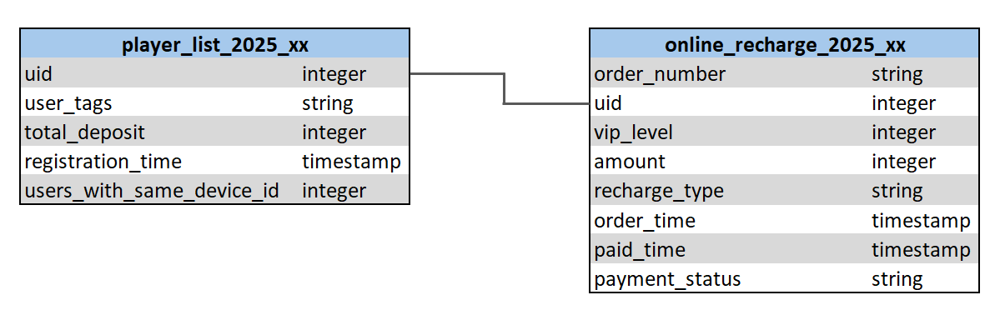
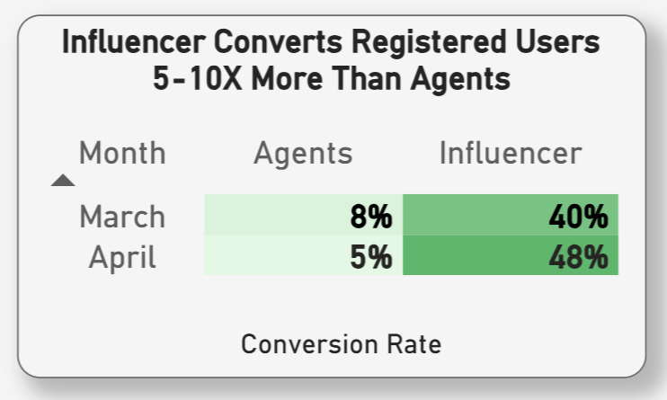
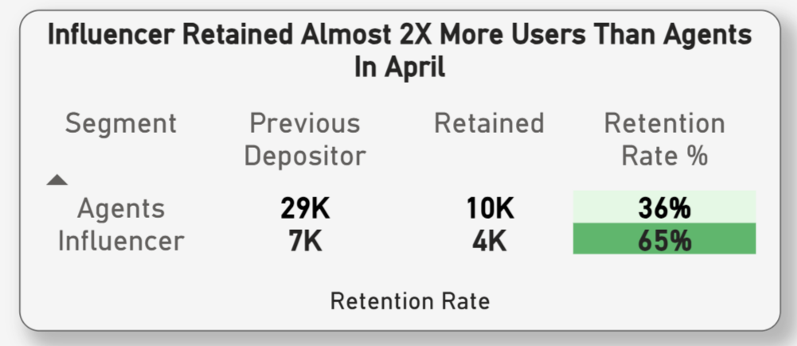
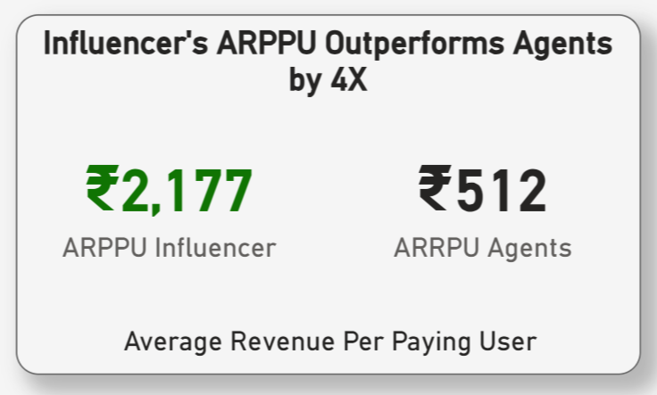
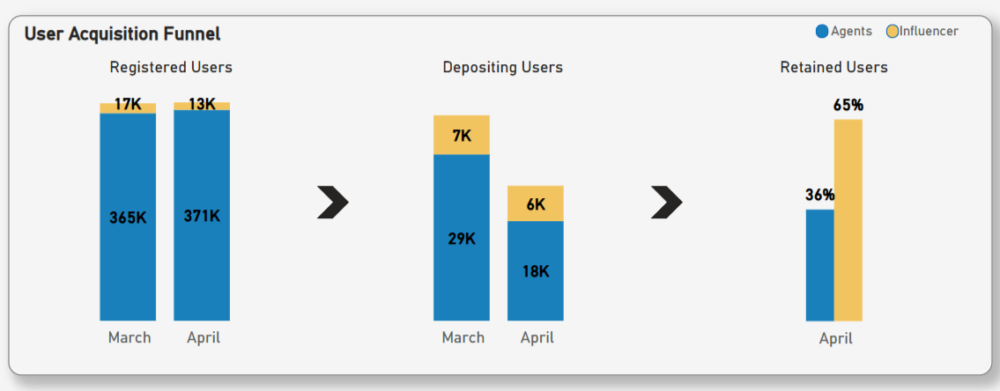
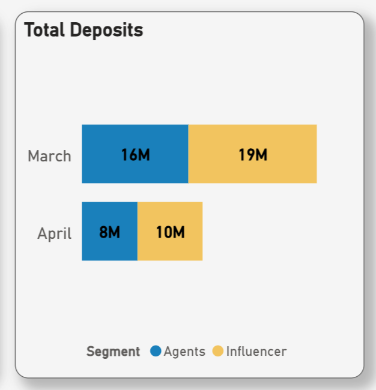

# **User Acquisition Performance Analysis: Agents vs Influencer - Project Overview**

A fantasy sports platform, established in **2023**, targeting the **Indian market**, where users join **paid contests daily**.

Following the **February crisis**, which caused a significant loss of player trust, the company initiated efforts to **rebuild user confidence and accelerate growth**. As part of this recovery plan, the company explored onboarding a **high-profile influencer** for the first time to evaluate whether her involvement could deliver meaningful business impact despite the high upfront partnership cost.

This project was designed to **test and compare the influencer’s performance against the existing agent acquisition program**, helping guide future decisions on whether to invest further in influencer marketing or continue expanding the agent network through higher cost of partnership.

The analysis was conducted from **March to the end of April 2025** and was actively used in decision-making discussions with the Operations Manager, Finance Lead, and Promotion Coordinator.

> **Disclaimer:**  
All payment channel names and user information in this dataset have been anonymized to protect privacy and confidentiality, following data handling practices aligned with standards such as PCI DSS and ISO 27001. This project showcases a real-world business case with anonymized data to ensure no personally identifiable information (PII) is disclosed.

🔗 **Resources**  
👉 [**Power BI Dashboard** – Viewable Online *(no download required)*](https://app.powerbi.com/view?r=eyJrIjoiZmE2NzBiNTAtYjIwOC00Yzc4LTljMDktMWU5OGM1NTRiYzY2IiwidCI6IjFjNWQyOWRjLTgzMDItNGE3YS04ODU4LTY1NzM5ZGY2ZWQyMyIsImMiOjEwfQ%3D%3D)  
📄 [*SQL Query – User Conversion (March 2025)*](./sql/user_acquisition_conversion_analysis.sql)    
📄 [*SQL Query – User Retention (April 2025)*](./sql/user_acquisition_retention_analysis.sql)  

---

# **Data Structure**

The data used in this project consists of **two main tables**:  
- `player_list_2025_xx`  
- `online_recharge_2025_xx`  

Table player_list contains monthly user registration data, and online_recharge contains monthly deposit transaction data. Each month, these tables collectively contain approximately **3 to 5 million rows**.

*The diagram below illustrates the data structure and relationships. In line with data minimization practices, only essential columns required for analysis were extracted to ensure privacy and focus on key business insights.*

  

---

# **Executive Summary**

Following the **February crisis**, in March and April 2025, the company tested a new user acquisition strategy by onboarding a high-profile influencer to compare her performance against the existing agent acquisition program. The analysis evaluates **three core performance metrics** to assess the influencer’s business impact relative to her higher partnership cost:

## **Conversion Rate**
- Influencer consistently outperformed agents in user conversion during both **March and April 2025**.
- In March, the influencer achieved a **40% conversion rate**, **5 times higher** than the agents **8%**.
- In April, the gap widened further, with the influencer reaching a **48% conversion rate**—almost **10 times higher** than the agents **5%**.

This result demonstrate the influencer's **strong brand pull** and **effectiveness in driving immediate user engagement** despite more premium partnership cost.

  

## **Retention Rate**
- Influencer retained almost **twice as many users** compared to agents in April 2025.
- Agents had 29K previous depositors but retained only 36%, while **influencers retained 65% despite only having 7K depositors**.
- The higher retention rate despite a smaller user base highlights the **influencer's stronger loyalty impact**.

This highlights the influencer’s ability to drive stronger user loyalty and **long-term revenue impact**.

  

## **Average Revenue Per Paying User (ARPPU)**
- Influencer-acquired users generated significantly **higher revenue per paying user**, with an **ARPPU of ₹2,177** compared to agents at just **₹512**.
- This represents a **4X higher ARPPU**, indicating that users brought in by influencers tend to **spend substantially more**.
- The higher spending behavior strengthens the business case for partnering with the influencer despite higher upfront costs.

This highlights the influencer’s exceptional ability not only to acquire but also to monetize users effectively, making her a **highly profitable and strategic acquisition partner despite the premium cost**.

 

---

# **Insight Deep Dive**

## **User Acquisition Funnel**
- **Registered Users**: Influencer consistently acquired fewer new users compared to agents, highlighting a **more selective but high-quality audience** *(March: 17K vs 365K, April: 13K vs 371K)*.
- **Depositing Users**: Despite lower registrations, influencer-converted users **deposited at significantly higher rates**— 7K in March and 6K in April versus 29K and 18K from agents.
- **Retained Users**: Influencer segment showed **stronger loyalty, retaining 65% of paying users in April, nearly double the agents 36% retention rate**.

 

## **Total Deposits**
- Users acquired through the influencer **maintained higher total deposits** than agents in both March and April.
- This demonstrates the influencer’s ability to **attract high-value users who consistently generate greater revenue**.

---

# **Recommendations**

- **Onboard the Influencer to Recover Post-Crisis Growth**

    After the February crisis, the company explored influencer marketing as a strategic initiative to regain user trust and accelerate growth. Data-driven analysis confirmed the influencer’s competence, proven by her **significantly higher conversion rates, superior retention rates, and 4x higher average revenue per paying user compared to agents**. Positioning her as **a key driver for business recovery and a strategic partner for future high-value growth initiatives.**

- **Maximize Influencer’s Impact for Premium Campaigns and Platform Scale-Up**
    
    Despite acquiring fewer new users, the influencer consistently delivered **outstanding performance —achieving 48% conversion, 65% retention, and ₹2,177 average revenue per paying user**. Her exceptional ability to **attract and engage high-value users** presents a unique opportunity to not only **boost profitability** but also **elevate user experience and scale up the platform through a more loyal and premium player base**.

- **Establish a Data-Driven Cost Benchmark for Influencer Negotiations**
    
    This analysis provides a strong foundation to consistently monitor the influencer’s performance and **set a clear pricing benchmark for negotiations**. These insights **help set the bar for partnership negotiations** and ensure any agreements are based on real performance outcomes.

---

# **Tools Used**
- **PostgreSQL**: Data anonymization, extraction, cleaning, transformation, and KPI calculations  
- **Power BI**: Visual to support clearer insight and decision-making  
- **Excel**: Used for character encoding adjustments to ensure clean, compliant data for SQL processing  
- **VS Code**: Used for SQL script writing, markdown documentation, and project file management  
